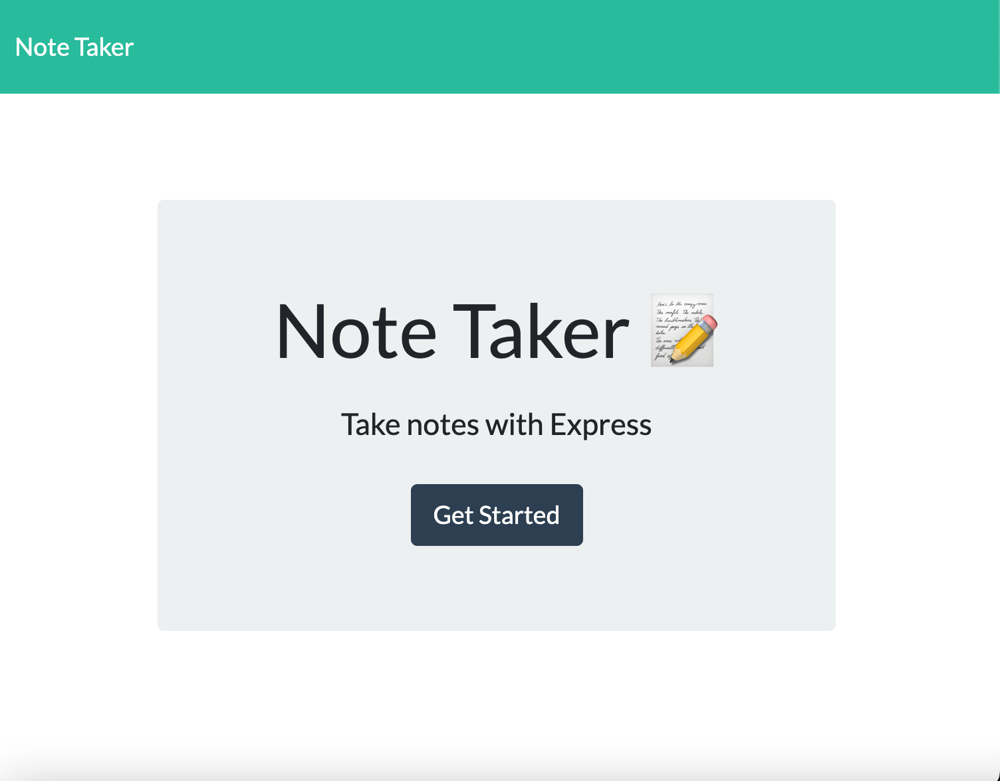
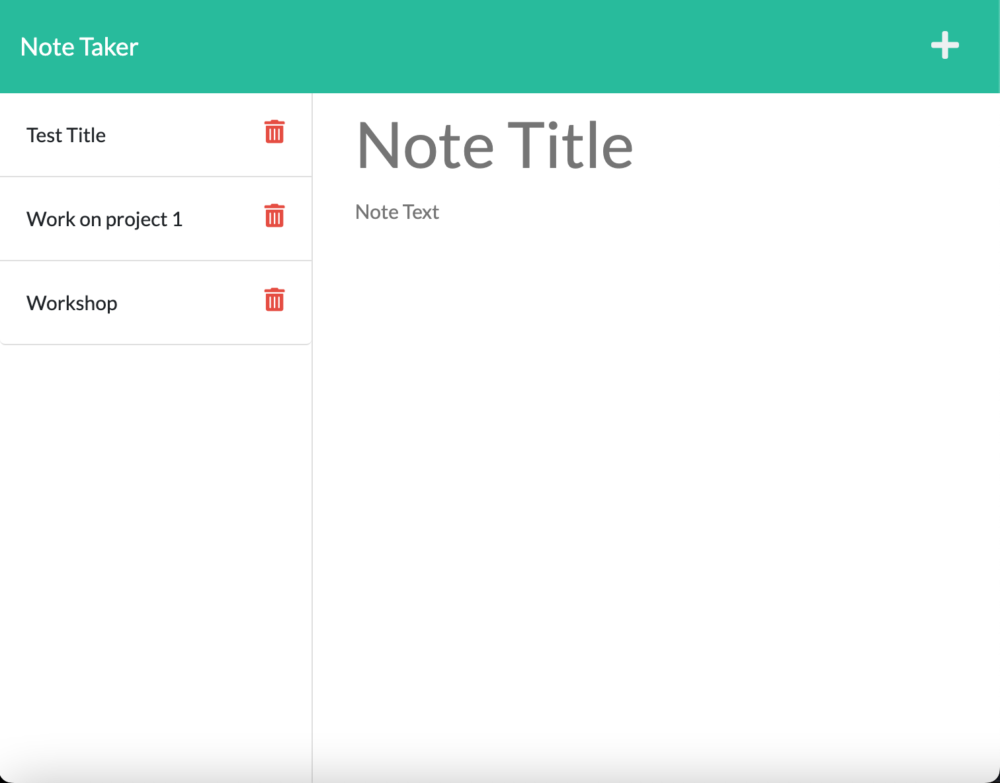
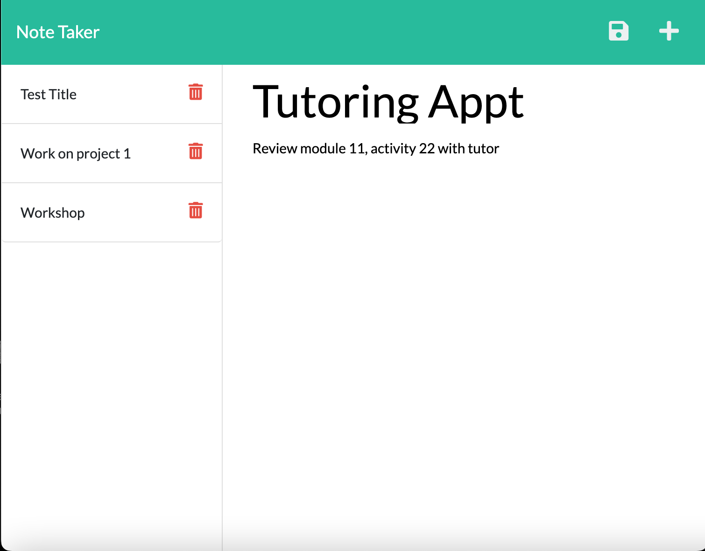
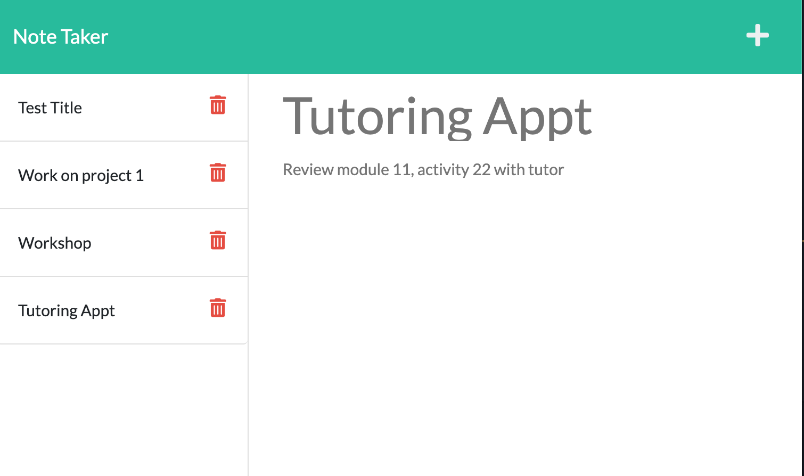

# c-11-Express-Note-Taker

## Description

My motivation for this project was to modify starter code so that the application would allow users to save and retrieve note data from an Express.js back end. I contributed to this project so that I could practice using Express.js, Uuidv4, Node.js, and learn to deploy an application to Heroku. This application lets users write and save notes so they can organize their thoughts and keep track of tasks they need to complete.

## Table of Contents

- [Installation](#installation)
- [Usage](#usage)
- [Credits](#credits)
- [License](#license)

## Installation
Cloning the repo is not necessary to use the application, but in case users wish to clone the application they must use their command line to go to the folder where the application has been cloned. Next they will type “npm i” and the return key to download all the packages needed to use the application. Users can then type “npm start” and the return key; they will see a message that says "Server is listening on PORT: 3001”. To go straight to the application click on the link below.

### Deployed site on Heroku:  
https://vast-depths-98905.herokuapp.com
### Github Repo:  
https://github.com/perfectblue0/c-11-Express-Note-Taker 
### For a video preview of the basic functionality of this application, visit this link:
https://drive.google.com/file/d/1g-ORa_GDdGaKYOMAqe5AMHqOEp6g6f0L/view

## Usage
Once on the application page users may click the button “Get Started” to go to the note taking page.  

  

Users may click on the “Note Title” area and type in the title of their new note. Next users can click on the smaller “Note Text” to write their new note.  

  

When users have finished writing their note, they can then click on the save icon located to the left of the “+” that will save their new note.  

   
On the left side of the application, users can see their new note title and when they click on the title they will be able to view the title and body of their newly written note, and older notes as well.  

 

## Credits
I used starter code provided by UC Berkeley Full-Stack Coding Bootcamp. I made my project with help from the Zoom recordings of in class instruction and a Youtube video tutorial by Thomas Calle found here: https://www.youtube.com/watch?v=-UiqzvUe360
## License
Please refer to the repo.

